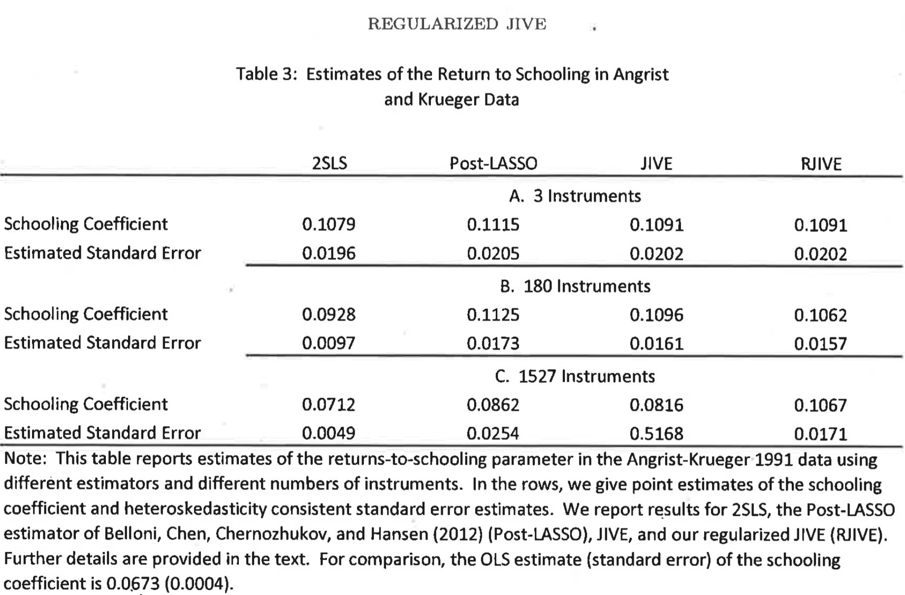
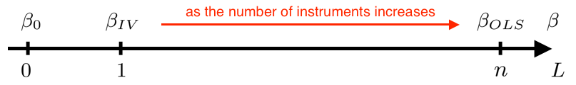

```{r, include=FALSE, echo=FALSE}
# Import packages
library(tidyverse)    # Fur alles
library(data.table)   # For freadr
library(knitr)        # For kable
library(broom)        # For tidy
library(AER)          # For ivreg
```

```{r load julia if not loaded, include=FALSE, echo=FALSE}
if (!("JuliaCall" %in% (.packages()))) {
  library(JuliaCall)
  julia <- julia_setup("/Users/mcourt/Documents/Julia-1.5.app/Contents/Resources/julia/bin")
}
```

```{julia, include=FALSE, echo=FALSE}
#import Pkg
#Pkg.add("LinearAlgebra")
#Pkg.add("Random")
#Pkg.add("Statistics")
#Pkg.add("Distributions")
#Pkg.add("DataFrames")
#Pkg.add("CSV")
#Pkg.add("Optim")

using LinearAlgebra
using Random
using Statistics
using Distributions
using DataFrames
using CSV
using Optim
```

## Instrumental Variables

### Endogeneity

We say that there is **endogeneity** in the linear regression model if $\mathbb E[x_i \varepsilon_i] \neq 0$.

The random vector $z_i$ is an **instrumental variable** in the linear regression model if the following conditions are met.

- **Exclusion restriction**: the instruments are uncorrelated with the regression error
  $$
    \mathbb E_n[z_i \varepsilon_i] = 0 
  $$
  almost surely, i.e. with probability $p \to 1$.
- **Rank condition**: no linearly redundant instruments
  $$
    \mathbb E_n[z_i z_i'] \neq 0 
  $$
  almost surely, i.e. with probability $p \to 1$.
- **Relevance condition** (need $L > K$):
  $$
    rank \ (\mathbb E_n[z_i x_i']) = K
  $$
  almost surely, i.e. with probability $p \to 1$.
  


### IV and 2SLS

Let $K = dim(x_i)$ and $L = dim(z_i)$. We say that the model is **just-identified** if $L = K$ (method: IV) and **over-identified** if $L > K$ (method: 2SLS). 

Assume $z_i$ satisfies the instrumental variable assumptions above and $dim(z_i) = dim(x_i)$, then the **instrumental variables (IV)** estimator $\hat{\beta} _ {IV}$ is given by
$$
\begin{aligned}
	\hat{\beta} _ {IV} &= \mathbb E_n[z_i x_i']^{-1} \mathbb E_n[z_i y_i] = \newline
	&= \left( \frac{1}{n} \sum _ {i=1}^n z_i x_i\right)^{-1} \left( \frac{1}{n} \sum _ {i=1}^n z_i y_i\right) = \newline
	&= (Z'X)^{-1} (Z'y) 
\end{aligned}
$$

Assume $z_i$ satisfies the instrumental variable assumptions above and $dim(z_i) > dim(x_i)$, then the **two-stage-least squares (2SLS)** estimator $\hat{\beta} _ {2SLS}$ is given by
$$
	\hat{\beta} _ {2SLS} =  \Big( X'Z (Z'Z)^{-1} Z'X \Big)^{-1} \Big( X'Z (Z'Z)^{-1} Z'y \Big)
$$
Where $\hat{x}_i$ is the predicted $x_i$ from the **first stage** regression of $x_i$ on $z_i$. This is equivalent to the IV estimator using $\hat{x}_i$ as an instrument for $x_i$. 


### 2SLS Algebra

- The estimator is called **two-stage-least squares** since it can be rewritten as an IV estimator that uses $\hat{X}$ as instrument:
	$$
	\begin{aligned}
		\hat{\beta} _ {\text{2SLS}} &= \Big( X'Z (Z'Z)^{-1} Z'X \Big)^{-1} \Big( X'Z (Z'Z)^{-1} Z'y \Big) = \newline
		&= (\hat{X}' X)^{-1} \hat{X}' y = \newline
		&= \mathbb E_n[\hat{x}_i x_i']^{-1} \mathbb E_n[\hat{x}_i y_i] 
	\end{aligned}
	$$
	
- Moreover it can be rewritten as
	$$
	\begin{aligned}
		\hat{\beta} _ {\text{2SLS}} &= (\hat{X}' X)^{-1} \hat{X}' y = \newline
		&= (X' P_Z X)^{-1} X' P_Z y = \newline
		&= (X' P_Z P_Z X)^{-1} X' P_Z y = \newline
		&= (\hat{X}' \hat{X})^{-1} \hat{X}' y = \newline
		&= \mathbb E_n [\hat{x}_i \hat{x}_i]^{-1} \mathbb E_n[\hat{x}_i y_i] 
	\end{aligned}
	$$

### Rule of Thumb

How to the test the relevance condition? Rule of thumb: $F$-test in the first stage $>10$ (joint test on $z_i$). 

> **Problem**: as $n \to \infty$, with finite $L$, $F \to \infty$ (bad rule of thumb). 


### Equivalence

**Theorem**

If $K=L$, $\hat{\beta} _ {\text{2SLS}} = \hat{\beta} _ {\text{IV}}$. 

**Proof**

If $K=L$, $X'Z$ and $Z'X$ are squared matrices and, by the relevance condition, non-singular (invertible).
$$
\begin{aligned}
	\hat{\beta} _ {\text{2SLS}} &= \Big( X'Z (Z'Z)^{-1} Z'X \Big)^{-1} \Big( X'Z (Z'Z)^{-1} Z'y \Big) = \newline
	&= (Z'X)^{-1} (Z'Z) (X'Z)^{-1} X'Z (Z'Z)^{-1} Z'y = \newline
	&= (Z'X)^{-1} (Z'Z) (Z'Z)^{-1} Z'y = \newline
	&= (Z'X)^{-1} (Z'y) = \newline
	&= \hat{\beta} _ {\text{IV}}
\end{aligned}
$$
$$\tag*{$\blacksquare$}$$


### Demand Example

**Example** from Hayiashi (2000) page 187: demand and supply simultaneous equations. 
$$
\begin{aligned}
	& q_i^D(p_i) = \alpha_0 + \alpha_1 p_i + u_i \newline
	& q_i^S(p_i) = \beta_0 + \beta_1 p_i + v_i 
\end{aligned}
$$

We have an endogeneity problem. To see why, we solve the system of equations for $(p_i, q_i)$:
$$
\begin{aligned}
	& p_i = \frac{\beta_0 - \alpha_0}{\alpha_1 - \beta_1} + \frac{v_i - u_i}{\alpha_1 - \beta_1 } \newline
	& q_i = \frac{\alpha_1\beta_0 - \alpha_0 \beta_1}{\alpha_1 - \beta_1} + \frac{\alpha_1 v_i - \beta_1 u_i}{\alpha_1 - \beta_1 } 
\end{aligned}
$$


### Demand Example (2)

Then the price variable is not independent from the error term in neither equation:
$$
\begin{aligned}
	& Cov(p_i, u_i) = - \frac{Var(u_i)}{\alpha_1 - \beta_1 } \newline
	& Cov(p_i, v_i) = \frac{Var(v_i)}{\alpha_1 - \beta_1 } 
\end{aligned}
$$

As a consequence, the OLS estimators are not consistent:
$$
\begin{aligned}
	& \hat{\alpha} _ {1, OLS} \overset{p}{\to} \alpha_1 + \frac{Cov(p_i, u_i)}{Var(p_i)} \newline
	& \hat{\beta} _ {1, OLS} \overset{p}{\to} \beta_1 + \frac{Cov(p_i, v_i)}{Var(p_i)} 
\end{aligned}
$$


### Demand Example (3)

In general, running regressing $q$ on $p$ you estimate
$$
\begin{aligned}
  \hat{\gamma} _ {OLS} &\overset{p}{\to} \frac{Cov(p_i, q_i)}{Var(p_i)} = \newline
  &= \frac{\alpha_1 Var(v_i) + \beta_1 Var(u_i)}{(\alpha_1 - \beta_1)^2} \left( \frac{Var(v_i) + Var(u_i)}{(\alpha_1 - \beta_1)^2} \right)^{-1} = \newline
  &= \frac{\alpha_1 Var(v_i) + \beta_1 Var(u_i)}{Var(v_i) + Var(u_i)} 
\end{aligned}
$$
Which is neither $\alpha_1$ nor $\beta_1$ but a variance weighted average of the two.


### Demand Example (4)

Suppose we have a supply shifter $z_i$ such that 

- $\mathbb E[z_i v_i] \neq 0$ 
- $\mathbb E[z_i u_i] = 0$. 

We combine the second condition and $\mathbb E[u_i] = 0$ to get a system of 2 equations in 2 unknowns: $\alpha_0$ and $\alpha_1$.
$$
\begin{aligned}
	& \mathbb E[z_i u_i] = \mathbb E[ z_i (q_i^D(p_i) - \alpha_0 - \alpha_1 p_i) ] = 0 \newline
	& \mathbb E[u_i] = \mathbb E[q_i^D(p_i) - \alpha_0 - \alpha_1 p_i] = 0  
\end{aligned}
$$

We could try to solve for the vector $\alpha$ that solves
$$
\begin{aligned}
	& \mathbb E_n[z_i (q_i^D - x_i\alpha)] = 0 \newline
	& \mathbb E_n[z_i q_i^D] -  \mathbb E_n[z_ix_i\alpha] = 0 
\end{aligned}
$$

If $\mathbb E_n[z_ix_i]$ is invertible, we get $\hat{\alpha} = \mathbb E_n[z_ix_i]^{-1} \mathbb E_n[z_i q^D_i]$ which is indeed the IV estimator of $\alpha$ using $z_i$ as an instrument for the endogenous variable $p_i$. 


### Code - DGP

This code draws 100 observations from the model $y = 2 x_1 - x_2 + \varepsilon$ where $x_1, x_2 \sim U[0,1]$ and $\varepsilon \sim N(0,1)$.

```{julia}
# Set seed
Random.seed!(123);

# Set the number of observations
n = 100;

# Set the dimension of Z
l = 3;

# Draw instruments
Z = rand(Uniform(0,1), n, l);

# Correlation matrix for error terms
S = [1 0.8; 0.8 1];

# Endogenous X
γ = [2 0; 0 -1; -1 3];
ε = rand(Normal(0,1), n, 2) * cholesky(S).U;
X = Z*γ .+ ε[:,1];

# Calculate y
y = X*β .+ ε[:,2];
```


### Code - IV

```{julia}
# Estimate beta OLS
β_OLS = (X'*X)\(X'*y)

# IV: l=k=2 instruments
Z_IV = Z[:,1:k];
β_IV = (Z_IV'*X)\(Z_IV'*y)

# Calculate standard errors
ε_hat = y - X*β_IV;
V_NHC_IV = var(ε_hat) * inv(Z_IV'*X)*Z_IV'*Z_IV*inv(Z_IV'*X);
V_HC0_IV = inv(Z_IV'*X)*Z_IV' * (I(n) .* ε_hat.^2) * Z_IV*inv(Z_IV'*X);
```


### Code - 2SLS

```{julia}
# 2SLS: l=3 instruments
Pz = Z*inv(Z'*Z)*Z';
β_2SLS = (X'*Pz*X)\(X'*Pz*y)

# Calculate standard errors
ε_hat = y - X*β_2SLS;
V_NCH_2SLS = var(ε_hat) * inv(X'*Pz*X);
V_HC0_2SLS = inv(X'*Pz*X)*X'*Pz * (I(n) .* ε_hat.^2) *Pz*X*inv(X'*Pz*X);
```


## GMM

### Setting

We have a system of $L$ moment conditions
$$
\begin{aligned}
	& \mathbb E[g_1(\omega_i, \delta_0)] = 0 \newline
	& \vdots \newline
	& \mathbb E[g_L(\omega_i, \delta_0)] = 0
\end{aligned}
$$

If $L = \dim (\delta_0)$, no problem. If $L > \dim (\delta_0)$, there may be no solution to the system of equations. 


### Options

There are two possibilities.

1. **First Solution**: add moment conditions until the system is identified
	$$
	  \mathbb E[ a' g(\omega_i, \delta_0)] = 0
	$$
    Solve $\mathbb E[Ag(\omega_i, \delta)] = 0$ for $\hat{\delta}$. How to choose $A$? Such that it minimizes $Var(\hat{\delta})$.	
2. **Second Solution**: generalized method of moments (GMM)
	$$
	\begin{aligned}
	  \hat{\delta} _ {GMM} &= \arg \min _ \delta \quad  \Big| \Big| \mathbb E_n [ g(\omega_i, \delta) ] \Big| \Big| = \newline
	  &= \arg \min _ \delta \quad n \mathbb E_n[g(\omega_i, \delta)]' W \mathbb E_n [g(\omega_i, \delta)]
	\end{aligned}
	$$
	
> The choice of $A$ and $W$ are closely related to each other.


### 1-step GMM

Since $J(\delta,W)$ is a quadratic form, a closed form solution exists:
$$
	\hat{\delta}(W) = \Big(\mathbb E_n[z_i x_i'] W \mathbb E_n[z_i x_i'] \Big)^{-1}\mathbb E_n[z_i x_i'] W \mathbb E_n[z_i y_i]
$$

**Assumptions** for consistency of the GMM estimator given data $\mathcal D = \lbrace y_i, x_i, z_i \rbrace _ {i=1}^n$:

- **Linearity**: $y_i = x_i\gamma_0 + \varepsilon_i$
- **IID**: $(y_i, x_i, z_i)$ iid
- **Orthogonality**: $\mathbb E [z_i(y_i - x_i\gamma_0)] = \mathbb E[z_i \varepsilon_i] = 0$
- **Rank identification**: $\Sigma_{xz} = \mathbb E[z_i x_i']$ has full rank 


### Convergence

**Theorem**

Under linearity, independence, orthogonality and rank conditions, if $\hat{W} \overset{p}{\to} W$ positive definite, then 
$$
	\hat{\delta}(\hat{W}) \to \delta(W)
$$
If in addition to the above assumption, $\sqrt{n} \mathbb E_n [g(\omega_i, \delta_0)] \overset{d}{\to} N(0,S)$ for a fixed positive definite $S$, then
$$
	\sqrt{n} (\hat{\delta} (\hat{W}) - \delta(W)) \overset{d}{\to} N(0,V)
$$
where $V = (\Sigma' _ {xz} W \Sigma _ {xz})^{-1} \Sigma _ {xz} W S W \Sigma _ {xz}(\Sigma' _ {xz} W \Sigma _ {xz})^{-1}$.

Finally, if a consistent estimator $\hat{S}$ of $S$ is available, then using sample analogues $\hat{\Sigma}_{xz}$ it follows that 
$$
	\hat{V} \overset{p}{\to} V
$$

> If $W = S^{-1}$ then $V$ reduces to $V = (\Sigma' _ {xz} W \Sigma _ {xz})^{-1}$. Moreover, $(\Sigma' _ {xz} W \Sigma _ {xz})^{-1}$ is the smallest possible form of $V$, in a positive definite sense.

Therefore, to have an efficient estimator, you want to construct $\hat{W}$ such that $\hat{W} \overset{p}{\to} S^{-1}$.


### 2-step GMM

Estimation steps:

- Choose an arbitrary weighting matrix $\hat{W}_{init}$ (usually the identity matrix $I_K$)
- Estimate $\hat{\delta} _ {init}(\hat{W} _ {init})$
- Estimate $\hat{S}$ (asymptotic variance of the moment condition) 
- Estimate $\hat{\delta}(\hat{S}^{-1})$

> On the procedure:
>
- This estimator achieves the semiparametric efficiency bound.
- This strategy works only if $\hat{S} \overset{p}{\to} S$ exists.
- For iid cases: we can use $\hat{\delta} = \mathbb E_n[(\hat{\varepsilon}_i z_i)(\hat{\varepsilon}_i z_i) ' ]$ where $\hat{\varepsilon}_i = y_i - x_i \hat{\delta}(\hat{W} _ {init})$.

### Code - 1-step GMM

```{julia}
# GMM 1-step: inefficient weighting matrix
W_1 = I(l);

# Objective function
gmm_1(b) = ( y - X*b )' * Z * W_1 *  Z' * ( y - X*b );

# Estimate GMM
β_gmm_1 = optimize(gmm_1, β_OLS).minimizer

# Standard errors GMM
ε_hat = y - X*β_gmm_1;
S_hat = Z' * (I(n) .* ε_hat.^2) * Z;
d_hat = -X'*Z;
V_gmm_1 = inv(d_hat * inv(S_hat) * d_hat')
```


### Code - 2-step GMM

```{julia}
# GMM 2-step: efficient weighting matrix
W_2 = inv(S_hat);

# Objective function
gmm_2(b) = ( y - X*b )' * Z * W_2 *  Z' * ( y - X*b );

# Estimate GMM
β_gmm_2 = optimize(gmm_2, β_OLS).minimizer

# Standard errors GMM
ε_hat = y - X*β_gmm_2;
S_hat = Z' * (I(n) .* ε_hat.^2) * Z;
d_hat = -X'*Z;
V_gmm_2 = inv(d_hat * inv(S_hat) * d_hat')
```


### Testing Overidentifying Restrictions

If the equations are **exactly identified**, then it is possible to choose $\delta$ so that all the elements of the sample moments $\mathbb E_n[g(\omega_i; \delta)]$ are zero and thus that the distance
$$
J(\delta, \hat{W}) = n \mathbb E_n[g(\omega_i, \delta)]' \hat{W} \mathbb E_n[g(\omega_i, \delta)]
$$
is zero. (The $\delta$ that does it is the IV estimator.)

If the equations are **overidentified**, i.e. $L$ (number of instruments) $> K$ (number of equations), then the distance cannot be zero exactly in general, but we would expect the minimized distance to be *close* to zero.


### Naive Test

Suppose your model is overidentified ($L > K$) and you use the following naive testing procedure:

1. Estimate $\hat{\delta}$ using a subset of dimension $K$ of instruments $\lbrace z_1 , .. , z_K\rbrace$ for $\lbrace x_1 , ... , x_K\rbrace$
2. Set $\hat{\varepsilon}_i = y_i - x_i \hat{\delta} _ {\text{GMM}}$
3. Infer the size of the remaining $L-K$ moment conditions $\mathbb E[z _{i, K+1} \varepsilon_i], ..., \mathbb E[z _{i, L} \varepsilon_i]$ looking at their empirical counterparts $\mathbb E_n[z _{i, K+1} \hat{\varepsilon}_i], ..., \mathbb E_n[z _{i, L} \hat{\varepsilon}_i]$
4. Reject exogeneity if the empirical expectations are high. How high? Calculate p-values. 


### Example

If you have two invalid instruments and you use one to test the validity of the other, it might happen by chance that you don't reject it.

- Model: $y_i = x_i + \varepsilon_i$ and $x_i = \frac{1}{2} z _{i1} -  \frac{1}{2} z _{i2} + u_i$

- Have $$
  Cov (z _{i1}, z _{i2}, \varepsilon_i, u_i) = 
  \begin{bmatrix}
		1 & 0 & 0 & 0 \newline 0 & 1 & 0 & 0 \newline 0 & 0 & 1 & 0.5 \newline 0 & 0 & 0.5 & 1 
	\end{bmatrix}
	$$
- You want to test whether the second instrument is valid (is not since $\mathbb E[z_2 \varepsilon] \neq 0$).
		You use $z_1$ and estimate $\hat{\beta} \to$ the estimator is consistent.
- You obtain $\mathbb E_n[z _{i2} \hat{\varepsilon}_i] \simeq 0$ even if $z_2$ is invalid
- Problem: you are using an invalid instrument in the first place.


### Hansen's Test

**Theorem**:
We are interested in testing $H_0: \mathbb E[z_i \varepsilon_i] = 0$ against $H_1: \mathbb E[z_i \varepsilon_i] \neq 0$. Suppose $\hat{S} \overset{p}{\to} S$. Then 
$$
	J(\hat{\delta}(\hat{S}^{-1}) , \hat{S}^{-1}) \overset{d}{\to} \chi^2 _ {L-K}
$$
For $c$ satisfying $\alpha = 1- G_{L - K} ( c )$, $\Pr(J>c | H_0) \to \alpha$ so the test *reject $H_0$ if $J > c$* has asymptotic size $\alpha$.


### Comments

- The degrees of freedom of the asymptotic distribution are the number of overidentifying restrictions.
- This is a specification test, testing whether all model assumptions are true jointly. Only when we are confident that about the other assumptions, can we interpret a large $J$ statistic as evidence for the endogeneity of some of the $L$ instruments included in $x$.
- Unlike the tests we have encountered so far, the test is not consistent against some failures of the orthogonality conditions (that is, it is not consistent against some fixed elements of the alternative).
- Several papers in the July 1996 issue of JBES report that the finite-sample null rejection probability of the test can far exceed the nominal significance level $\alpha$. 

  

### Special Case: Conditional Homoskedasticity

The main implication of conditional homoskedasticity is that efficient GMM becomes 2SLS. With efficient GMM estimation, the weighting matrix is $\hat{S}^{-1} =  \mathbb En [z_i z_i' \varepsilon_i^2]^{-1}$. With conditional homoskedasticity,  the efficient weighting matrix is $\mathbb E_n[z_iz_i']^{-1} \sigma^{-2}$, or equivalently $\mathbb E_n[z_iz_i']^{-1}$. Then, the GMM estimator becomes
$$
	\hat{\delta}(\hat{S}^{-1}) = \Big(\mathbb E_n[z_i x_i']' \underbrace{\mathbb E_n[z_iz_i']^{-1} \mathbb E[z_i x_i']} _ {\text{ols of } x_i \text{ on }z_i} \Big)^{-1}\mathbb E_n[z_i x_i']' \underbrace{\mathbb E_n[z_iz_i']^{-1} \mathbb E[z_i y_i']} _ {\text{ols of } y_i \text{ on }z_i}= \hat{\delta} _ {2SLS}
$$

**Proof**:
Consider the matrix notation.
$$
\begin{aligned}
	\hat{\delta} \left( \frac{Z'Z}{n}\right) &= \left( \frac{X'Z}{n} \left( \frac{Z'Z}{n}\right)^{-1} \frac{Z'X}{n} \right)^{-1} \frac{X'Z}{n} \left( \frac{Z'Z}{n}\right)^{-1} \frac{Z'Y}{n} = \newline
	&= \left( X'Z(Z'Z)^{-1} Z'X \right)^{-1} X'Z(Z'Z)^{-1} Z'Y = \newline
	&= \left(X'P_ZX\right)^{-1} X'P_ZY = \newline
	&= \left(X'P_ZP_ZX\right)^{-1} X'P_ZY = \newline
	&= \left(\hat{X}'_Z \hat{X}_Z\right)^{-1} \hat{X}'_ZY = \newline
	&= \hat{\delta} _ {2SLS}
\end{aligned}
$$
$$\tag*{$\blacksquare$}$$


### Small-Sample Properties of 2SLS

**Theorem**:
When the number of instruments is equal to the sample size ($L = n$), then $\hat{\delta} _ {2SLS} = \hat{\delta} _ {OLS}$

**Proof**:
We have a perfect prediction problem. The first stage estimated coefficient $\hat{\gamma}$ is such that it solves the normal equations: $\hat{\gamma} = z_i^{-1} x_i$. Then
$$
\begin{aligned}
	\hat{\delta} _ {2SLS} &= \mathbb E_n[\hat{x}_i x'_i]^{-1} \mathbb E_n[\hat{x}_i y_i] = \newline
	&= \mathbb E_n[z_i z_i^{-1} x_i x'_i]^{-1} \mathbb E_n[z_i z_i^{-1} x_i y_i] = \newline
	&= \mathbb E_n[x_i x'_i]^{-1} \mathbb E_n[x_i y_i] = \newline
	&= \hat{\delta} _ {OLS}
\end{aligned}
$$
$$\tag*{$\blacksquare$}$$

> You have this overfitting problem in general when the number of instruments is large relative to the sample size. This problem arises even if the instruments are valid. 


### Example from Angrist (1992)

- They regress wages on years of schooling.
- **Problem**: endogeneity: both variables are correlated with skills which are unobserved.
- **Solution**: instrument years of schooling with the quarter of birth. 
  - **Idea**: if born in the first three quarters, can attend school from the year of your sixth birthday. Otherwise, you have to wait one more year. 

- **Problem**: quarters of birth are three dummies. 
  - In order to ``improve the first stage fit" they interact them with year of birth (180 effective instruments) and also with the state (1527 effective instruments). 
  - This mechanically increases the $R^2$ but also increases the bias of the 2SLS estimator.

- **Solutions**: LIML, JIVE, RJIVE (Hansen et al., 2014), Post-Lasso (Belloni et al., 2012).


### Example from Angrist (1992)

{width=80%}


## Many Instrument Robust Estimation

### Issue

Why having too many instruments is problematic? As the number of instruments increases, the estimated coefficient gets closer to OLS which is biased. As seen in the theorem above, for $L=n$, the two estimators coincide. 




### LIML

An alternative method to estimate the parameters of the structural equation is by maximum likelihood. Anderson and Rubin (1949) derived the maximum likelihood estimator for the joint distribution of $(y_i, x_i)$. The estimator is known as **limited information maximum likelihood**, or **LIML**.

This estimator is called "limited information" because it is based on the structural equation for $(y_i, x_i)$ combined with the reduced form equation for $x_i$. If maximum likelihood is derived based on a structural equation for $x_i$ as well, then this leads to what is known as **full information maximum likelihood (FIML)**. The advantage of the LIML approach relative to FIML is that the former does not require a structural model for $x_i$, and thus allows the researcher to focus on the structural equation of interest - that for $y_i$. 


### K-class Estimators


The **k-class** estimators have the form
$$
	\hat{\delta}(\alpha) = (X' P_Z X - \alpha X' X)^{-1} (X' P_Z Y - \alpha X' Y) 
$$

The limited information maximum likelihood estimator **LIML** is the k-class estimator $\hat{\delta}(\alpha)$ where
$$
	\alpha = \lambda_{min} \Big( ([X' , Y]^{-1} [X' , Y])^{-1} [X' , Y]^{-1} P_Z [X' , Y] \Big) 
$$

If $\alpha = 0$ then $\hat{\delta} _ {\text{LIML}} = \hat{\delta} _ {\text{2SLS}}$ while for $\alpha \to \infty$, $\hat{\delta} _ {\text{LIML}} \to \hat{\delta} _ {\text{OLS}}$.


### Comments on LIML

- The particular choice of $\alpha$ gives a many instruments robust estimate
- The LIML estimator has no finite sample moments. $\mathbb E[\delta(\alpha_{LIML})]$ does not exist in general
- In simulation studies performs well
- Has good asymptotic properties 


Asymptotically the LIML estimator has the same distribution as 2SLS. However, they can have quite different behaviors in finite samples. There is considerable evidence that the LIML estimator has superior finite sample performance to 2SLS when there are many instruments or the reduced form is weak. However, on the other hand there is worry that since the LIML estimator is derived under normality it may not be robust in non-normal settings. 


### JIVE

The **Jacknife IV** procedure is the following

- Regress $\lbrace x_j \rbrace _ {j \neq i}$ on $\lbrace z_j \rbrace _ {j \neq i}$ and estimate $\pi_{-i}$ (leave the $i^{th}$ observation out).
- Form $\hat{x}_i = \hat{\pi} _ {-i} z_i$.
- Run IV using $\hat{x}_i$ as instruments.
$$
	\hat{\delta} _ {JIVE} = \mathbb E_n[\hat{x}_i x_i']^{-1} \mathbb E_n[\hat{x}_i y_i']
$$


### Comments on JIVE:

- Prevents overfitting.
- With many instruments you get bad out of sample prediction which implies low correlation between $\hat{x}_i$ and $x_i$: $\mathbb E_n[\hat{x}_i x_i'] \simeq 0$.
- Use lasso/ridge regression in the first stage in case of too many instruments. 


### Hausman Test

Here we consider testing the validity of OLS. OLS is generally preferred to IV in terms of precision. Many researchers only doubt the (joint) validity of the regressor $z_i$ instead of being certain that it is invalid (in the sense of not being predetermined). So then they wish to choose between OLS and 2SLS, assuming that they have an instrument vector $x_i$ whose validity is not in question. Further, assume for simplicity that $L = K$ so that the efficient GMM estimator is the IV estimator.


The **Hausman test statistic**
$$
	H \equiv n (\hat{\delta} _ {IV} - \hat{\delta} _ {OLS})' [\hat{Avar} (\hat{\delta} _ {IV} - \hat{\delta} _ {OLS})]^{-1} (\hat{\delta} _ {IV} - \hat{\delta} _ {OLS})
$$
is asymptotically distributed as a $\chi^2_{L-s}$ under the null where $s = | z_i \cup x_i |$: the number of regressors that are retained as instruments in $x_i$.


### Comments


In general, the idea of the Hausman test is the following. If you have two estimators, one which is efficient under $H_0$ but inconsistent under $H_1$ (in this case, OLS), and another which is consistent under $H_1$ (in this case, IV), then construct a test as a quadratic form in the differences of the estimators. Another classic example arises in panel data with the hypothesis $H_0$ of unconditional strict exogeneity. In that case, under $H_0$ Random Effects estimators are efficient but under $H_1$ they are inconsistent. Fixed Effects estimators instead are consistent under $H_1$.

The Hausman test statistic can be used as a pretest procedure: select either OLS or IV according to the outcome of the test. Although widely used, this pretest procedure is not advisable. When the null is false, it is still possible that the test *accepts* the null (committing a Type 2 error). In particular, this can happen with a high probability when the sample size is *small* and/or when the regressor $z_i$ is *almost valid*. In such an instance, estimation and also inference will be based on incorrect methods. Therefore, the overall properties of the Hausman pretest procedure are undesirable.

The Hausman test is an example of a specification test. There are many other specification tests. One could for example test for conditional homoskedasticity. Unlike for the OLS case, there does not exist a convenient test for conditional homoskedasticity for the GMM case. A test statistic that is asymptotically chi-squared under the null is available but is extremely cumbersome; see White (1982, note 2). If in doubt, it is better to use the more generally valid inference methods that allow for conditional heteroskedasticity. Similarly, there does not exist a convenient test for serial correlation for the GMM case. If in doubt, it is better to use the more generally valid inference methods that allow for serial correlation; for example, when data are collected over time (that is, time-series data).


