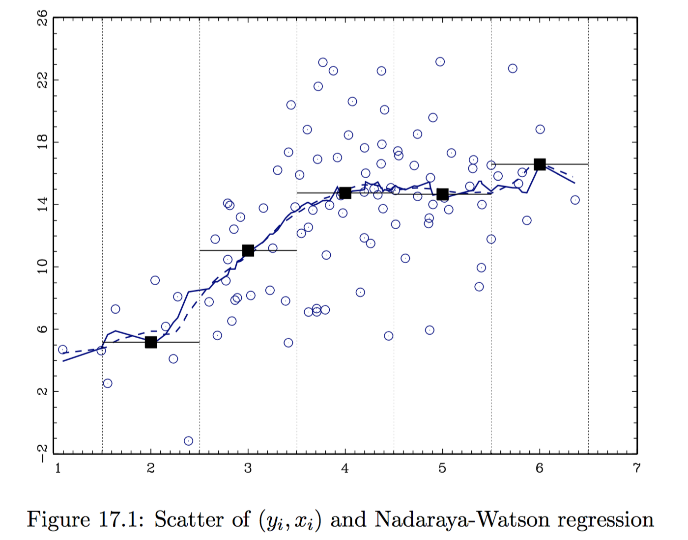
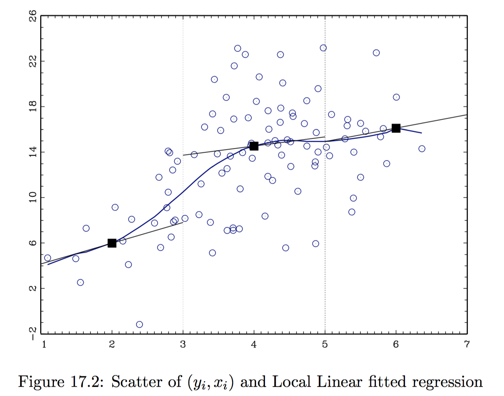
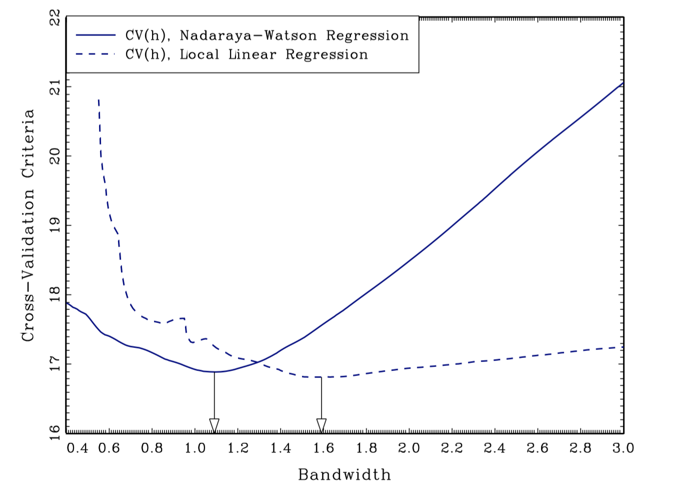
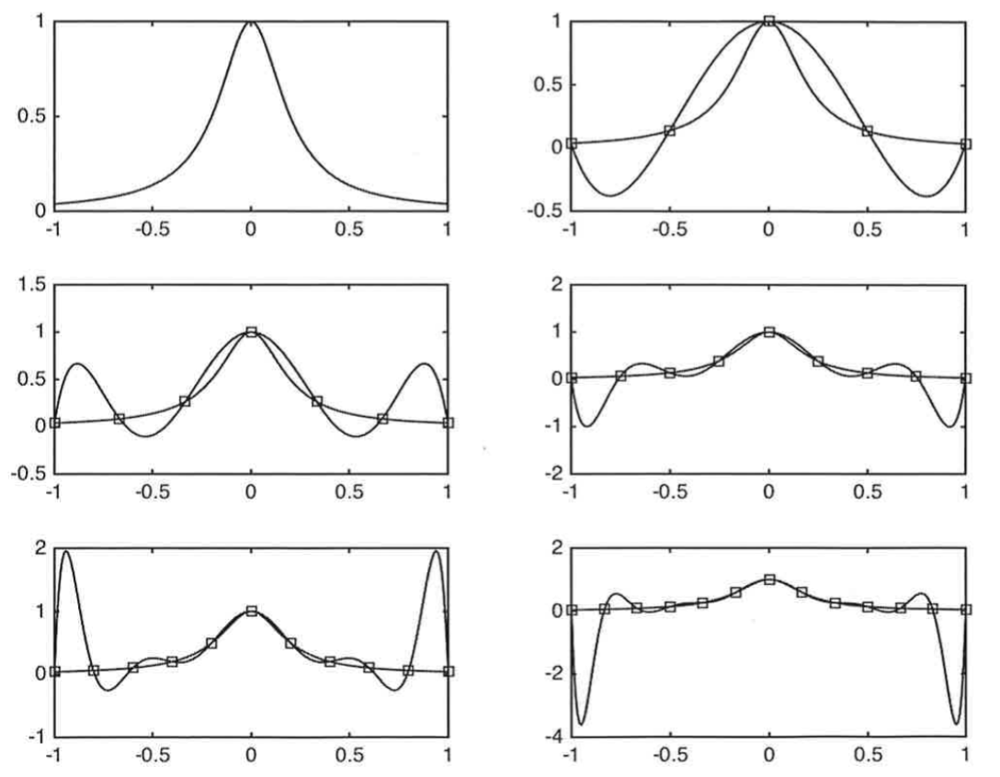
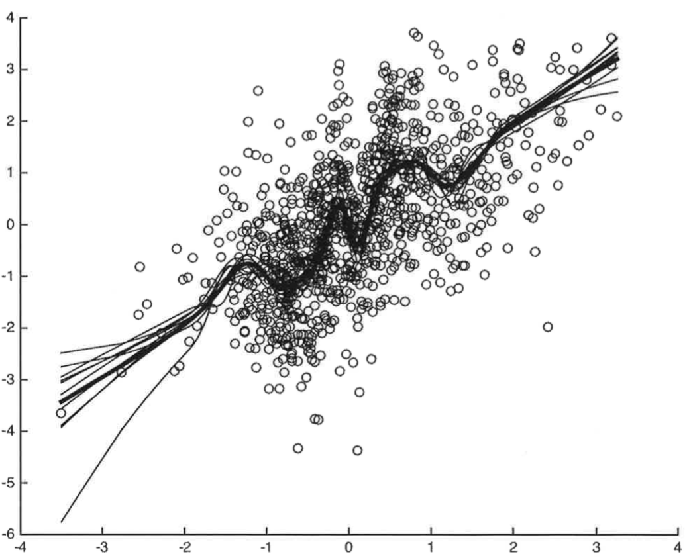

### Introduction

Non-parametric regression is a flexible estimation procedure for

1. regression functions $\mathbb E [y|x ] = g (x)$ and 
2. density functions $f(x)$.

You want to let your data to tell you how flexible you can afford to be in terms of estimation procedures. Non-parametric regression is naturally introduced in terms of fitting a curve.

Consider the problem of estimating the Conditional Expectation Function, defined as $\mathbb E [y_i |x_i ] = g(x_i)$ given data $D = (x_i, y_i)_{i=1}^n$ under minimal assumption of $g(\cdot)$, e.g. smoothness. There are two main methods: 

1. Local methods: Kernel-based estimation
2. Global methods: Series-based estimation

Another way of looking at non-parametrics is to do estimation/inference without specifying functional forms. With no assumptions, informative inference is impossible. Non parametrics tries to work with functional restrictions---continuity, differentiability, etc.---rather than pre-specifying functional form.

### Discrete x - Cell Estimator

Suppose that $x$ can take $R$ distinct values, e.g. gender $R=2$, years of schooling $R=20$, gender $\times$ years of schooling $R = 2 \times 20$.

A simple way for estimating $\mathbb E \left[ y |x \right] = g(x)$ is to split the sample to include observations with $x_i = x$ and calculate the sample mean of $\bar{y}$ for these observations. Note that this requires no assumptions about how $\mathbb E [y_i |x_i]$ varies with $x$ since we fit a different value for each value $x$.
$$
\hat{g}(x) = \frac{1}{| i: x_i = x |} \sum_{i : x_i = x} y_i
$$

Issues:

- **Curse of dimensionality**: if $R$ is big compared to $n$, there will be only a small number of observations per $x$ values. If $x_i$ is continuous, $R=n$ with probability 1. Solution: we can borrow information about $g_0(x)$ using neighboring observations of $x$.
- Averaging for each separate $x_r$ value is only feasible in cases where $x_i$ is coarsely discrete. 

## Local Non-Parametric Estimation

### Kernels

Suppose we believe that $\mathbb E [y_i |x_i]$ is a smooth function of $x_i$ -- e.g. continuous, differentiable, etc. Then it should not change too much across values of $x$ that are close to each other: we can estimate the conditional expectation at $x = \bar{x}$ by averaging $y$'s over the values of $x$ that are "close"" to $\bar{x}$. This procedure relies on two (three) arbitrary choices:

- Choice of the **kernel function** $K (\cdot)$; it is used to weight "far out"" observations, such that
  - $K: \mathbb R \to \mathbb R$
  - $K$ is symmetric: $K(\bar{x} + x_i) = K(\bar{x} - x_i)$
  - $\lim_{x_i \to \infty}K(x_i - \bar{x}) = 0$
- Choice of the **bandwidth** $h$: it measures the size of a ``small'' window around $\bar{x}$, e.g. $(\bar{x} - h, \bar{x} + h)$. 
- Choice of the local estimation procedure. Examples are locally constant, a.k.a. Nadaraya-Watson (**NW**), and locally linear (**LL**).

>Generally, the choice of $h$ is more important than $K(\cdot)$ in low dimensional settings.

### Optimal h

We need to define what is an "optimal" $h$, depending on the smoothness level of $g_0$, typically unknown. The choice of $h$ relates to the bias-variance trade-off:

- large $h$: small variance, higher bias;
- small $h$: high variance, smaller bias.

> Note that $K_h (\cdot) = K (\cdot / h)$.

### Locally Constant Estimator

- **Nadaraya-Watson** estimator, or locally constant estimator. It assumes the CEF locally takes the form $g(x) = \beta_0(x)$. The local parameter is estimated as:
$$
 \hat{\beta}_0 (\bar{x}) = \arg\min_{\beta_0}  \quad  \mathbb E_n \Big[ K_h (x_i - \bar{x}) \cdot  \big(y_i - \beta_0 \big)^2 \Big]
$$

{width=50%}

### CEF

The Nadaraya-Watson estimate of the CEF takes the form:
$$
\mathbb E_n \left[ y | x = \bar{x}\right] = \hat{g}(\bar{x}) = \frac{\sum_{i=1}^n y_i K_h (x_i - \bar{x})}{\sum_{i=1}^n K_h (x_i - \bar{x})}
$$

### Locally Linear Estimator

- **Local Linear** estimator. It assumes the CEF locally takes the form $g(x) = \beta_0(x) + \beta_1(x) x$. The local parameters are estimated as:

$$
  \left( \hat{\beta}_0 (\bar{x}), \hat{\beta}_1 (\bar{x}) \right) = \arg\min_{\beta_0, \beta_1}  \quad   \mathbb E_n \Big[ K_h (x_i - \bar{x}) \cdot  \big(y_i - \beta_0 - (x_i - \bar{x}) \beta_1 \big)^2 \Big]
$$

{width=50%}

### CEF

In this case, we do LS estimate with $i$'s contribution of residual weighted by the kernel $K_h (x_i - \bar{x})$. The final estimate at $\bar{x}$ is given by:
$$
  \hat{g} (\bar{x}) = \hat{\beta}_0 (\bar{x}) + (\bar{x} - \bar{x}) \hat{\beta}_1 (\bar{x}) = \hat{\beta}_0 (\bar{x})
$$
since we have centered the $x_s$ at $\bar{x}$ in the kernel. 
- It is possible to add linearly higher order polynomials, e.g. do locally quadratic least squares using loss function:

$$
  \mathbb E_n \left[ K_h (x_i - \bar{x}) \big(y_i - \beta_0 - (x_i - \bar{x}) \beta_1 - (x_i - \bar{x})^2 \beta_2 \big)^2 \right] 
$$

### Uniform Kernel

LS restricted to sample $i$ such that $x_i$ within $h$ of $\bar{x}$. 
$$
  \begin{aligned}
  & K (\cdot) = \mathbb I\lbrace \cdot \in [-1, 1] \rbrace  \newline
  & K_h (\cdot) = \mathbb I\lbrace \cdot/h \in [-1, 1] \rbrace = \mathbb I\lbrace \cdot \in [-h, h] \rbrace  \newline
  & K_h (x_i - \bar{x}) = \mathbb I\lbrace x_i - \bar{x} \in [-h, h] \rbrace  = \mathbb I\lbrace x_i \in [\bar{x}-h, \bar{x} + h] \rbrace 
  \end{aligned}
$$
Employed together with the locally linear estimator, the estimation procedure reduces to **local least squares}. The loss function is:
$$
\mathbb E_n \Big[ K_n (x_i - \bar{x}) \big(y_i -\beta_0 - \beta_1 (x_i - \bar{x}) \big)^2 \Big] = \frac{1}{n} \sum_{i: x_i \in [\bar{x}-h, \bar{x} +h ]}  \big(y_i -\beta_0 - \beta_1 (x_i - \bar{x}) \big)^2
$$

The more local is the estimation, the more appropriate the linear regression: if $g_0$ is smooth, $g_0(\bar{x}) + g_0'(\bar{x})  (x_i - \bar{x})$ is a better approximation for $g_0 (x_i)$.

However, the uniform density is not a good kernel choice as it produces discontinuous CEF estimates. The following are two popular alternative choices that produce continuous CEF estimates.

### Other Kernels

- **Epanechnikov kernel**
$$
	K_h(x_i - \bar{x}) = \frac { 3 } { 4 } \left( 1 - (x_i - \bar{x}) ^ { 2 } \right)  \mathbb I\lbrace x_i \in [\bar{x}-h, \bar{x} + h] \rbrace 
$$

- **Normal or Gaussian kernel**
$$
K_\phi (x_i - \bar{x})  = \frac { 1 } { \sqrt { 2 \pi } } \exp \left( - \frac { (x_i - \bar{x}) ^ { 2 } } { 2 } \right)
$$

- **K-Nearest Neighbors (KNN)**: choose bandwidth so that there is a fixed number of observations in each kernel. This kernel is different from the others since it takes a nonparamentric form.

### Example

### Choice of the optimal bandwidth

Practical methods:

- **Eyeball Method.** (i) Choose a bandwidth (ii) Estimate the regression function (iii) Look at the result: if it looks more wiggly than you would like, increase the bandwidth: if it looks more smooth than you would like, decrease the bandwidth. Con: It only works for $\dim(x_i) = 1$ or $2$.

- **Rule of Thumb.** For example, Silverman's rule of thumb: $h = \left( \frac{4 \hat{\sigma}^5}{3n} \right)^{\frac{1}{5}}$.
 Con: It requires too much knowledge about $g_0$ (i.e. normality) which you don't have.

- **Cross Validation.** Under some assumptions, CV will approximately gives the MSE optimal bandwidth. The basic idea is to evaluate quality of the bandwidth by looking at how well the resulting estimator forecasts in the given sample.
	

Leave-one-out CV. For each $h > 0$ and each $i$, $\hat{g}_{-i} (x_i)$ is the estimate of the conditional expectation at $x_i$ using bandwidth $h$ and all observations expect observation $i$. The CV bandwidth is defined as
$$
	\hat{h} = \arg \min_h CV(h) = \arg \min_h \sum_{i=1}^n  \Big( y_i -  \hat{g}_{-i} (x_i) \Big)^2
$$

### Practical Tips

- Select a value for $h$.
- For each observation $i$, calculate
$$
  \hat{g}_{-i} (x_i) = \frac{\sum_{j \ne i} y_j K_h (x_j - x_i) }{\sum_{i=1}^n K_h (x_j - x_i)}, \qquad e_{i,h}^2 = \left(y_i - \hat{g}_{-i} (x_i) \right)^2
$$
- Calculate $\text{CV}(h) = \sum_{i=1}^n e^2_{i,h}$.
- Repeat for each $h$ and choose the one that minimizes $\text{CV}(h)$.
	

{width=50%}
	

### Inference

**Theorem**:
Consider data $\lbrace y_i, x_i \rbrace_{i=1}^n$, iid and suppose that $y_i = g(x_i) + \varepsilon_i$ where $\mathbb E[\varepsilon_i|x_i] = 0$. Assume that $x_i \in Interior(X)$ where $X \subseteq \mathbb R$, $g(x)$ and $f(x)$ are three times continuously differentiable, and $f(x) > 0$ on $X$. $f(x)$ is the probability density of $x \in X$ , and $g(x)$ is the function of interest. Suppose that $K(\cdot)$ is a kernel function. Suppose $n\to\infty$, $h\to0$ , $nh\to\infty$, and $nh^7\to0$. Then for any fixed $x\in X$,
$$
  AMSE = \sqrt{nh} \Big( \hat{g}(x) - g(x) - h^2 B(x)\Big) \overset{d}{\to} N \left( 0, \frac{\kappa \sigma^2(x)}{f(x)}\right)
$$
for $\sigma^2(x) = Var(y_i|x_i = x)$, $\kappa = \int K^2(v)dv$, and $B(x) = \frac{\kappa_2}{2} \frac{f'(x)g'(x) + f(x) g''(x)}{f(x)}$ where $\kappa_2 = \int v^2 K(v)dv$.

### Remarks

- If the function is smooth enough and the bandwidth small enough, you can ignore the bias relative to sampling variation. To make this plausible, use a smaller bandwidth than would be the "optimal".
- All kernel regression estimators can be written as a weighted average
$$
  \hat{g}(x) = \frac{1}{n} \sum_{i=1}^n w_i (x) y_i, \quad \text{ with } \quad w_i (x) = \frac{n K_h (x_i - x)}{\sum_{i=1}^n K_h (x_i - x)}	
$$
Do inference as if you were estimating a mean $\mathbb E[z_i]$ with sample mean $\frac{1}{n} \sum_{i=1}^n z_i$ using $z_i = w_i (x) y_i$.
- If you are doing inference at more than one value of $x$, do inference as in the previous point, treating each value of $x$ as a different sample mean and note that even with independent data, these means will be correlated in general because there will generally be some common observations in to each of the averages. If you have a time series, make sure you account for correlation between the observations going in the different averages even if they don't overlap.

Issue when doing inference: the estimation of the bandwidth from the data is generally not accounted for in the distributional approximation (when doing inference). In large-samples, this is unlikely to lead to large changes, but uncertainty is understated in small samples.

### Bias-Variance Trade-off

**Theorem**

For any estimator mean-square error MSE is decomposable into variance and bias-squared:
$$
\text{MSE} (\bar{x}, \hat{g}) = \mathbb E \left[ \left( \hat{g}(\bar{x}) - g_0 (\bar{x}) \right)^2 \right] = \mathbb E \Big[\underbrace{ \hat{g}(\bar{x}) - g_0 (\bar{x}) }_{\text{Bias}} \Big]^2 +  Var (\hat{g} (\bar{x})). 
$$

### Proof

The theorem follows from the following corollary.

**Corollary**

Let $A$ be a random variable and $\theta_0$ a fixed parameter. Then,
$$
	\mathbb E [ (A - \theta_0)^2] = Var (A) + \mathbb E [A-\theta_0]^2
$$

**Proof**
$$
  \begin{aligned}
	\mathbb E [ (A - \theta_0)^2] & = \mathbb E[A^2] - 2 \mathbb E [A \theta_0] + \mathbb E [\theta_0] \newline
	&  = \mathbb E[A^2] \underbrace{-  \mathbb E[A]^2 + E[A]^2}_{\text{add and subtract}} - 2 \mathbb E [A \theta_0] + \mathbb E [\theta_0] \newline
	&  = Var(A) + \mathbb E [A]^2 - 2 \theta_0 \mathbb E [A ] + \mathbb E [\theta_0] \newline
	& = Var(A) + \mathbb E [A - \theta_0]^2
	\end{aligned}
$$

Note that $\mathbb E [ (A - \theta_0)^2] = \mathbb E [A - \theta_0]^2$.
$$\tag*{$\blacksquare$}$$

### Criteria

Which criteria should we use with non-parametric estimators?

- **Mean squared error (MSE)**:
$$
	\text{MSE} (\bar{x}) (\hat{g}) = \mathbb E \left[ \left( \hat{g}(\bar{x}) - g_0 (\bar{x}) \right)^2 \right] 
$$
**NB!** This is the criterium we are going to use.

- **Integrated mean squared error (IMSE)**:
$$
	\text{IMSE} ( \hat{g} ) = \mathbb E \left[ \int | \hat{g} (x) - g_0 (x) |^2 \mathrm{d} F(x)  \right] 
$$

- Type I - Type II error.

### Comments

Hansen (2019): the theorem above implies that we can asymptotically approximate the MSE as
$$
\text{AMSE} = \Big( h^2 \sigma_k^2 B(x) \Big)^2 + \frac{\kappa \sigma^2(x)}{nh f(x)} \approx \text{const} \cdot \left( h^4 + \frac{1}{n h} \right) 
$$

Where

- $Var \propto \frac{1}{h n}$, where you can think of $n h$ as the **effective sample size**.
- Bias $\propto h^2$, derived if $g_0$ is twice continuously differentiable using Taylor expansion.

### Trade-Off

The asymptotic MSE is dominated by the larger of $h^4$ and $\frac{1}{h n}$. Notice that the bias is increasing in $h$ and the variance is decreasing in $h$ (more smoothing means more observations are used for local estimation: this increases the bias but decreases estimation variance). To select $h$ to minimize the asymptotic MSE, these two components should balance each other:
$$
\frac{1}{h n} \propto h^4 \quad \Rightarrow \quad  h \propto n^{-1/5} 
$$

This result means that the bandwidth should take the form $h = c \cdot n^{-1/5}$. The optimal constant $c$ depends on the kernel $k$ the bias function $B(x)$ and the marginal density $f_x(x)$. A common misinterpretation is to set $h = n^{-1/5}$ which is equivalent to setting $c = 1$ and is completely arbitrary. Instead, an empirical bandwidth selection rule such as cross-validation should be used in practice.

## Global Non-Parametric Estimation

### Series

The goal is to try to globally approximate the CEF with a function $g(x)$. Series methods are based on the **Stone-Weierstrass theorem**: a real-valued continuous function $g(x)$ defined in a compact set can be approximated with polynomials for any degree of accuracy
$$
g_0 (x) = p_1 (x) \beta _1 + \dots + p_K (x) \beta_K + r(x)
$$
where $p_1(x), \dots, p_K(x)$ are called ``a dictionary of approximating series'' and $r(x)$ is a remainder function. If $p_1(x), \dots, p_K(x)$ are sufficiently rich, $r(x)$ will be small. If $K \to \infty$, then $r \to 0$.

> Example - Taylor series: if $g(x)$ is infinitely differentiable, then
$$
g(x) = \sum_{k=0}^{\infty } a_k x^k
$$
where $a_k = \frac{1}{k!} \frac{\partial^k g_0}{\partial x^k}$.

### In Practice

The basic idea is to approximate the infinite sum by chopping it off after $K$ terms and then estimate the coefficients by OLS.

**Series estimation**:

- Choose $K$, i.e. the number of series terms, and an approximating dictionary $p_1(x), \dots, p_K(x)$
- Expand data to $D = \left( y_i, p_1(x_i), \dots, p_K(x_i) \right)_{i=1}^n$
- Estimate OLS to get $\hat{\beta}_1, \dots, \hat{\beta}_K$
- Set $\hat{g}(x) = p_1 (x)\hat{\beta}_1 + \dots + p_K(x) \hat{\beta}_K$

### Examples

- **Monomials**: $p_1(x) = 1, p_2(x) = x, p_3(x)=x^2, \dots$	

- **Hermite Polynomials**: $p_1(x) = 1$, $p_2(x) = x$, $p_3(x)=x^2 -1$, $p_4(x)= x^3 - 3x, \dots$. Con: **edge effects**. The estimated function is particularly volatile at the edges of the sample space (Gibbs effect)

- **Trig Polynomials**: $p_1(x) = 1$, $p_2(x) = \cos 2 \pi x$, $p_3(x)= \sin 2 \pi x$, $p_4(x) = \cos 2 \pi x \cdot 2 x \dots$. Pro: cyclical therefore good for series. Con: edge effects

- **B-splines**: recursively constructed using knot points
$$
  B_{i, 0} = \begin{cases}
  1 & \text{if } t_i \leq x < t_{i+1} \newline 0 & \text{otherwise}
  \end{cases} \qquad B_{i_k} (x) = \frac{x - t_i}{ t_{i+k} - t_i} B_{i, k-1} (x) +  \frac{t_{i+k+1}-x}{t_{i+k+1} - t_{i+1}} B_{i+1, k-1} (x)
$$
where $t_0, \dots, t_i, \dots$ are knot points and $k$ is the order of the spline.
Pro: faster rate of convergence and lower asymptotic bias.

### Hermite Polynomials

{width=50%}

### Estimation

Given $K$, inference proceeds exactly as if one had run an OLS of $y$ on $(p_k)_{k=1}^K$. The idea is that you ignore that you are doing non-parametric regression as long as you believe you have put enough terms (high $K$). Then the function is smooth enough so that the bias of the approximation is small relative to the variance (see Newey, 1997). Note that his approximation does not account for data-dependent estimation of the bandwidth.

### Consistency

Newey (1997): results about consistency of $\hat{g}$ and asymptotic normality of $\hat{g}$.

- OLS: $\hat{\beta} \overset{p}{\to} \beta_0$
- Non-parametric: you have a sequence $\lbrace\beta_k\rbrace_{k=1}^K$ with $\hat{\beta}_k \overset{p}{\to} \beta_k$ as $n \to \infty$ (as $k \to \infty$). However, this does not make sense because $\lbrace\beta_k\rbrace$ is not constant. Moreover, $\beta_k$ is not the quantity of interest. We want to make inference on $\hat{g}(x)$.

**Theorem**

Under regularity conditions, including $| | \hat{\beta} - \beta_0 | | \overset{p}{\to} 0$, 

- Uniform Consistency: $\sup_x | \hat{g}(x) - g_0(x)| \overset{p}{\to} 0$
- Mean-square Consistency: $\int  | \hat{g}(x) - g_0(x)|^2 \mathrm{d} F(x) \overset{p}{\to} 0$

### IMSE

**Theorem**

Under the following assumptions:

- $(x_i, y_i)$ are iid and $Var(y_i|x_i)$ is bounded;
- For all $K$, there exists a non-singular matrix $B$ such that $A = \left[ (B p(x)) (B p(x))' \right]$ where $p(x) = \left( p_1(x), \dots, p_K (x) \right)$ has the properties that $\lambda_{\min} (A)^{-1} = O(1)$. In addition, $\sup_x | | B p(x) | | = o(\sqrt{K/n})$.
- There exists $\alpha$ and $\beta_K$ for all $K$ such that
$$
	\sup_x | g_0 (x) - p(x) \beta_K | = O_p(K^{-\alpha})
$$

Then, it holds that
	
$$
  \text{IMSE = }\int \left( g_0 (x) - \hat{g} (x) \right)^2 \mathrm{d} F(x) = O_p \left( \frac{K}{n} + K^{-2\alpha}\right)
$$

### Choice of the optimal $K$

The bias-variance trade-off for series comes in through the choice of $K$:

- Higher $K$: smaller bias, since we are leaving out less terms form the infinite sum.
- Smaller $K$: smaller variance, since we are estimating less regression coefficients from the same amount of data.

**Cross-validation for series**:
For each $K \geq 0$ and for each $i=1, \dots, n$, consider

$$
  D_{-i} = \lbrace (x_1, y_1), \dots, (x_{i-1}, y_{i-1}),(x_{i+1}, y_{i+1}), \dots (x_n, y_n) \rbrace
$$
and calculate $\hat{g}^{(K)}_{-i} (x)$ using series estimate with $p_1(x), \dots, p_K (x)$ in order to get $e^{(K)}_i = y_i - \hat{g}^{(K)}_{-i} (x_i)$. Choose $\hat{K}$ such that

$$
  \hat{K} = \arg \min_K \mathbb E_n \left[ {e^{(K)}_i}^2 \right]
$$

### Inference

Consider the data $D = \lbrace (x_i, y_i) \rbrace_{i=1}^n$ such that $y_i = g_0 (x_i) + \varepsilon_i$. You may want to form confidence intervals for quantities that depends on $g_0$.

> Example: $\theta_0$ functional forms of interests: 
>
- Point estimate: $\theta_0 = g_0 (\bar{x} )$ for fixed $\bar{x}$
- Interval estimate: $\theta_0 = g_0 (\bar{x}_2) - g_0 (\bar{x}_1)$
- Point derivative estimate: $\theta_0 = g_0 ' (\bar{x})$ at $\bar{x}$
- Average derivative $\theta_0 =  \mathbb E [g_0 ' (x) ]$
- Consumer surplus: $\theta_0 = \int_a^b g_0(x)dx \quad$ when $g_0$ is a demand function. 

Those estimates are functionals: maps from a function to a real number. We are doing inference on a function now, not on a point estimate.

### Inference

In order to form a confidence interval for $\theta_0$, with series you can 

- **Undersmooth**: in order to apply a \textit{central limit theorem}, you need deviations around the function to be approximately gaussian. Undersmoothing makes the function oscillate much more than the curve you are estimating in order to obtain such guassian deviations.
- Use the **delta method**. It would usually require more series terms than a criterion like cross-validation would suggest.

### Undersmoothing

{width=50%}
	

If on the contrary you oversmooth (e.g. $g_0$ linear), errors are going to constantly be on either one or the other side of the curve $\to$ not gaussian!

### Delta Method

**Theorem**:
Under the assumptions of the consistency theorem 
$$
\frac{\sqrt{n} \Big(\hat{\theta} - \theta_0 + B(r_K) \Big)}{\sqrt{v_K}} \overset{d}{\to} N (0,1)
$$

**Theorem**:
Under the assumptions of the consistency theorem and $\sqrt{n} K^{-\alpha} = o(1)$ (or equivalently $n K^{-2\alpha} = O(1)$ in Hansen), 
$$
  \frac{\sqrt{n} \Big(\hat{\theta} - \theta_0 \Big)}{\sqrt{v_K}} \overset{d}{\to} N (0,1)
$$

### Remark

- The rate of convergence of splines is faster than for power series (Newey 1997).
- We have **undersmoothing** if $\sqrt{n} K^{\alpha} = o(1)$ (see comment below)
- Usually, in order to prove asymptotic normality, we first prove unbiasedness. However here we have a **biased** estimator but we make the bias converge to zero faster than the variance.

Hansen (2019): The critical condition is the assumption that $\sqrt{n} K^{\alpha} = o(1)$ This requires that $K \to \infty$ at a rate faster than $n^{\frac{1}{2\alpha}}$ This is a troubling condition. The optimal rate for estimation of $g(x)$ is $K = O(n^{\frac{1}{1+ 2\alpha}})$. If we set $K = n^{\frac{1}{1+ 2\alpha}}$ by this rule then $n K^{-2\alpha} = n^{\frac{1}{1+ 2\alpha}} \to \infty$ not zero. Thus this assumption is equivalent to assuming that $K$ is much larger than optimal. The reason why this trick works (that is, why the bias is negligible) is that by increasing $K$ the asymptotic bias decreases and the asymptotic variance increases and thus the variance dominates. Because $K$ is larger than optimal, we typically say that $\hat{g}(x)$ is **undersmoothed** relative to the optimal series estimator.

### More Remarks

> Many authors like to focus their asymptotic theory on the assumptions in the theorem, as the distribution of $\theta$ appears cleaner. However, it is a poor use of asymptotic theory. There are three problems with the assumption $\sqrt{n} K^{-\alpha} = o(1)$ and the approximation of the theorem. 
>
- First, it says that if we intentionally pick $K$ to be larger than optimal, we can increase the estimation variance relative to the bias so the variance will dominate the bias. But why would we want to intentionally use an estimator which is sub-optimal?
- Second, the assumption $\sqrt{n} K^{-\alpha} = o(1)$ does not eliminate the asymptotic bias, it only makes it of lower order than the variance. So the approximation of the theorem is technically valid, but the missing asymptotic bias term is just slightly smaller in asymptotic order, and thus still relevant in finite samples. 
- Third, the condition $\sqrt{n} K^{\alpha} = o(1)$ is just an assumption, it has nothing to do with actual empirical practice. Thus the difference between the two theorems is in the assumptions, not in the actual reality or in the actual empirical practice. Eliminating a nuisance (the asymptotic bias) through an assumption is a trick, not a substantive use of theory. My strong view is that the result (1) is more informative than (2). It shows that the asymptotic distribution is normal but has a non-trivial finite sample bias.

### Kernel vs Series

Hansen (2019): in this and the previous chapter we have presented two distinct methods of nonparametric regression based on kernel methods and series methods. Which should be used in practice? Both methods have advantages and disadvantages and there is no clear overall winner.

First, while the asymptotic theory of the two estimators appear quite different, they are actually rather closely related. When the regression function $g(x)$ is twice differentiable $(s = 2)$ then the rate of convergence of both the MSE of the kernel regression estimator with optimal bandwidth $h$ and the series estimator with optimal $K$ is $n^{-\frac{2}{k+4}}$ (where $k = \dim(x)$).  There is no difference. If the regression function is smoother than twice differentiable ($s > 2$) then the rate of the convergence of the series estimator improves. This may appear to be an advantage for series methods, but kernel regression can also take advantage of the higher smoothness by using so-called higher-order kernels or local polynomial regression, so perhaps this advantage is not too large.

Both estimators are asymptotically normal and have straightforward asymptotic standard error formulae. The series estimators are a bit more convenient for this purpose, as classic parametric standard error formula work without amendment.

### Advantages of Kernels

An advantage of kernel methods is that their distributional theory is easier to derive. The theory is all based on local averages which is relatively straightforward. In contrast, series theory is more challenging, dealing with increasing parameter spaces. An important difference in the theory is that for kernel estimators we have explicit representations for the bias while we only have rates for series methods. This means that plug-in methods can be used for bandwidth selection in kernel regression. However, typically we rely on cross-validation, which is equally applicable in both kernel and series regression.

Kernel methods are also relatively easy to implement when the dimension of $x$, $k$, is large. There is not a major change in the methodology as $k$ increases. In contrast, series methods become quite cumbersome as $k$ increases as the number of cross-terms increases exponentially. E.g ($K=2$) with $k=1$ you have only $\lbrace x_1, x_1^2\rbrace$; with $k=2$ you have to add $\lbrace x_2, x_2^2, x_1 x_2 \rbrace$; with $k=3$ you have to add $\lbrace x_3, x_3^2, x_1 x_3, x_2 x_3\rbrace$, etc..

### Advantages of Series

A major advantage of series methods is that it has inherently a high degree of flexibility, and the user is able to implement shape restrictions quite easily. For example, in series estimation it is relatively simple to implement a partial linear CEF, an additively separable CEF, monotonicity, concavity or convexity. These restrictions are harder to implement in kernel regression.

