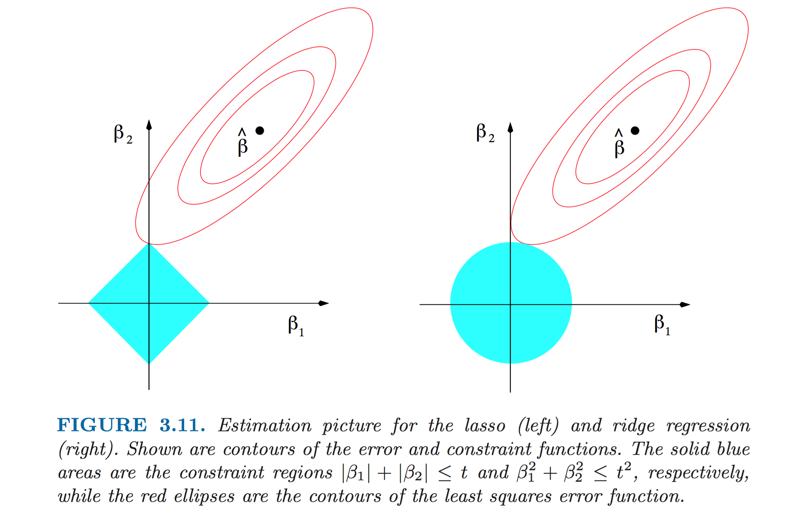
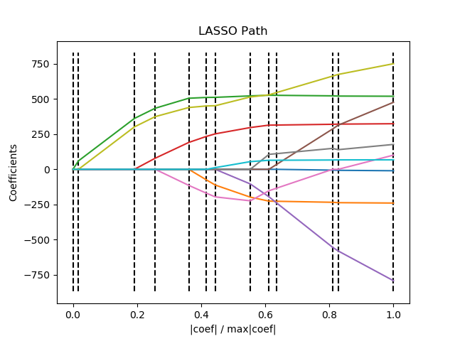
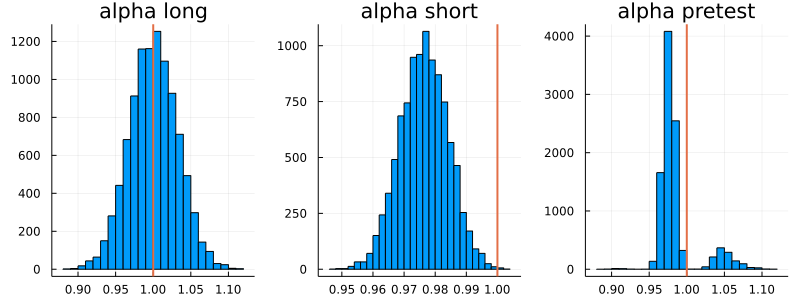
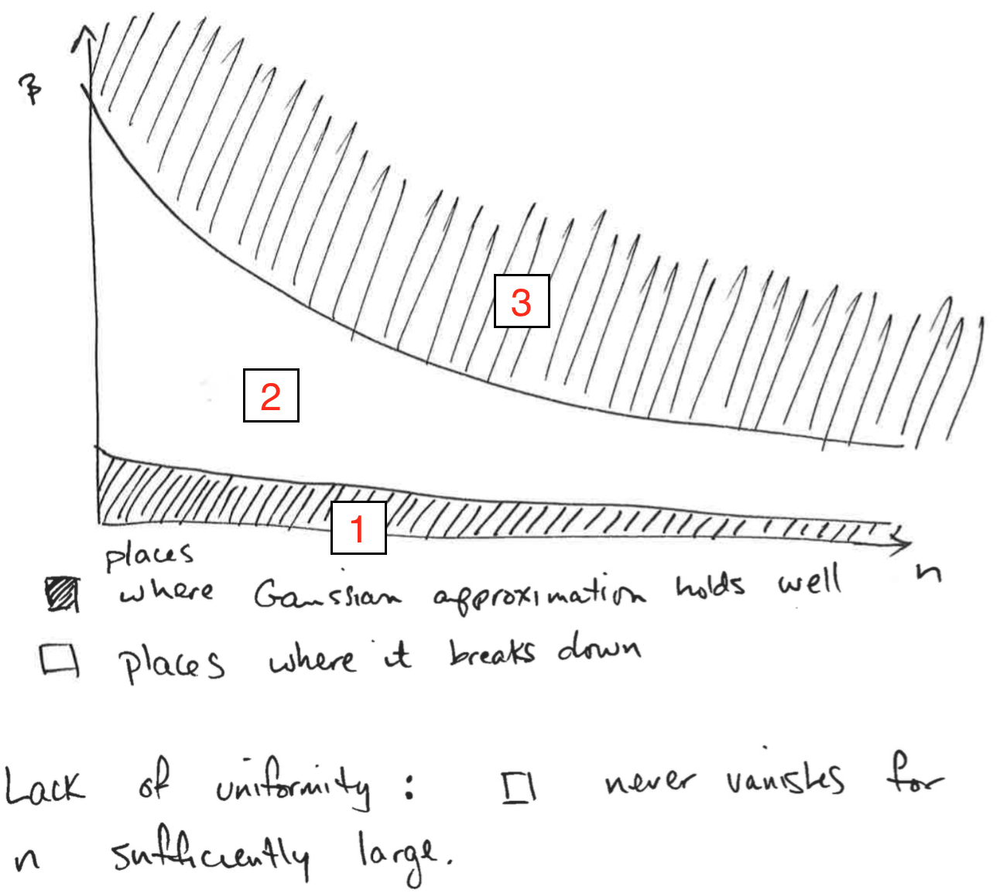
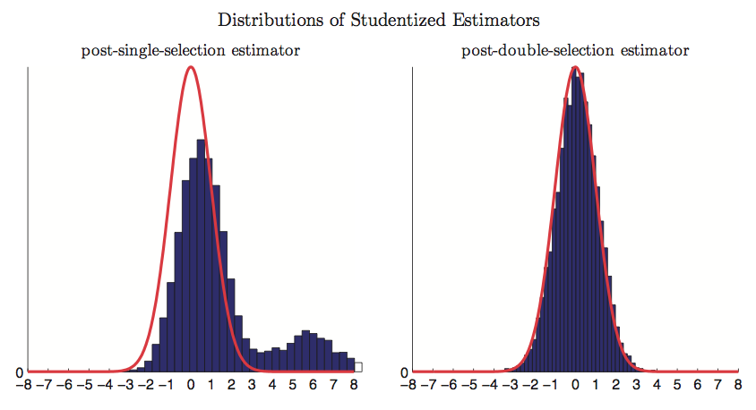

```{r, include=FALSE, echo=FALSE}
# Import packages
library(tidyverse)    # Fur alles
library(data.table)   # For freadr
library(knitr)        # For kable
library(broom)        # For tidy
library(AER)          # For ivreg
```

```{r load julia if not loaded, include=FALSE, echo=FALSE}
if (!("JuliaCall" %in% (.packages()))) {
  library(JuliaCall)
  julia <- julia_setup("/Users/mcourt/Documents/Julia-1.5.app/Contents/Resources/julia/bin")
}
```

```{julia, include=FALSE, echo=FALSE}
#import Pkg
#Pkg.add("LinearAlgebra")
#Pkg.add("Random")
#Pkg.add("Statistics")
#Pkg.add("Distributions")
#Pkg.add("DataFrames")
#Pkg.add("CSV")
#Pkg.add("Optim")

using LinearAlgebra
using Random
using Statistics
using Distributions
using DataFrames
using CSV
using Optim
```

## Lasso

### Issue

Lasso (Least Absolute Shrinkage and Selection Operator) is a popular method for high dimensional regression. It does variable selection and estimation simultaneously. It is a non-parametric (series) estimation technique part of a general class of estimators called *penalized estimators*. It allows the number of regressors, $p$, to be larger than the sample size, $n$.

Consider data $D = \lbrace x_i, y_i \rbrace_{i=1}^n$ with $\dim (x_i) = p$. Assume that $p$ is large relative to $n$. Two possible reasons:

- we have an intrinsic problem of high dimensionality
- $p$ indicates the number of expansion terms of small number of underlying important variables (e.g. series estimation)


**Assumption**:
$y_i = x_i' \beta_0 + r_i + \varepsilon_i$ where $\beta_0$ depends on $p$, $r_i$ is a remainder term.


Note that in classic non-parametrics, we have $x_i'\beta_0$ as $p_1(x_i) \beta_{1,K} + \dots + p_K(x_i) \beta_{K,K}$. For simplicity, we assume $r_i = 0$, as if we had extreme undersmoothing. Hence the model becomes:
$$
	y_i = x_i' \beta_0 + \varepsilon_i, \qquad p \geq n
$$
We cannot run OLS because $p \geq n$, thus the rank condition is violated.


### Definition

We define the **Lasso estimator** as
$$
	\hat{\beta}_L = \arg \min \quad \underbrace{\mathbb E_n \Big[ (y_i - x_i' \beta)^2 \Big]}_{\text{SSR term}} + \underbrace{\frac{\lambda}{n} \sum_{j=1}^{P} | \beta_j |}_{\text{Penalty term}}
$$
where  $\lambda$ is called **penalty parameter**.

The **penalty term** discourages large values of $| \beta_j |$. 
The choice of $\lambda$ is analogous to the choice of $K$ in series estimation and $h$ in kernel estimation.


### Penalties

The shrinkage to zero of the coefficients directly follows from the $|| \cdot ||_1$ norm. On the contrary, another famous penalized estimator, *ridge regression*, uses the $|| \cdot ||_2$ norm and does not have this property.

{width=50%}


> Minimizing SSR + penalty is equivalent to minimize SSR $s.t.$ pen $\leq c$ (clear from the picture).


### Sparsity

Let $S_0 = \lbrace j: \beta_{0,j} \ne 0 \rbrace$, we define $s_0 = \# S_0$ as the **sparsity** of $\beta_0$. If $s_0/n \to 0$, we are dealing with a **sparse regression** (analogous of smooth regression).

> Remark on sparsity:
>
- In words, sparsity means that even if we have a lot of variables, only a small number of them (relative to $n$) have an effect on the dependent variable.
- *Approximate sparsity imposes a restriction that only $s_0$ variables among all of $x_{ij}$, where $s_0$ is much smaller than $n$, have associated coefficients $\beta_{0j}$ that are different from zero, while permitting a nonzero approximation error. Thus, estimators for this kind of model attempt to learn the identities of the variables with large nonzero coefficients, while simultaneously estimating these coefficients.* (Belloni et al., 2004)
- Sparsity is an assumption. $\beta_0$ is said to be $s_0$-sparse with $s_0 < n$ if
$$
  | \lbrace j: \beta_{0j} \neq 0 \rbrace | \leq s_0
$$


### Lasso Theorem

**Theorem**
Suppose that for data $D_n = (y_i, x_i)_{i=1}^N$ with $y_i = x_i' \beta + \varepsilon_i$. Let $\hat{\beta}_L$ be the Lasso estimator. Let $\mathcal{S} = 2 \max_j | \mathbb E[ x_{ij} \varepsilon_i] |$. Suppose $|support(\beta_0) \leq s_0$ (sparsity assumption). Let $c_0 = (\mathcal{S} + \lambda/n )/(-\mathcal{S} + \lambda/n )$. Let
$$
	\kappa_{c_0, s_0} = \min_{  d \in \mathbb R^p, A \subseteq \lbrace 1, ... , p \rbrace : |A| \leq s_0 ,  || d_{A^c}|| \leq c_0 || d_A ||_1  }  \sqrt{  \frac{ s_0 d' \mathbb E_n [x_i x_i'] d }{|| d_A ||_1^2}  }
$$
Then

$$
\mathbb I_{ \left\lbrace \frac{\lambda}{n} > \mathcal{S}  \right\rbrace} \mathbb E_n [(x_i \beta_0 - x_i \beta_L)^2]^{\frac{1}{2}}  \leq 2 \frac{\lambda}{n} \frac{\sqrt{s_0}}{\kappa_{c_0, s_0}}
$$


Intuition: for a sufficiently high lambda the root mean squared error of Lasso is approximately zero.

$$
	\text{ RMSE }:  \mathbb E_n [(x_i \beta_0 - x_i \beta_L)^2]^{\frac{1}{2}}  \simeq 0  \quad \Leftrightarrow \quad \frac{\lambda}{n} > \mathcal{S}
$$


### Remarks

- The minimization region is the set of "essentially sparse" vectors $d \in \mathbb R^p$, where "essentially sparse" is defined by $\mathcal{C}, \mathcal{S}$. In particular the condition $k_{\mathcal{C}, \mathcal{S}}>0$ means that no essentially sparse vector $d$ has $\mathbb E[x_i x_i']d = 0$, i.e. regressors were not added multiple times.
- Need to dominate the score with the penalty term $\lambda$.
- Need no collinearity on a small ($\leq s_0$) subset of regressors ($\to k_{c_0, s_0}>0$).

**When Lasso?** For prediction problems in high dimensional environments. **NB!** Lasso is not good for inference, only for prediction.

In particular, in econometrics it's used for selecting either 

- instruments (predicting $\hat{x}$ in the first stage)
- control variables (next section: double prediction problem, in the first stage and in the reduced form)


### Choosing the Optimal Lambda

The choice of $\lambda$ determines the bias-variance tradeoff:

- if $\lambda$ is too big: $\lambda \approx \infty \mathbb \Rightarrow \hat{\beta} \approx 0$;
- if $\lambda$ is too small: $\lambda \approx 0 \mathbb \Rightarrow$ overfitting.

Possible solutions: Bonferroni correction, bootstrapping or $\frac{\lambda}{n} \asymp \sqrt{\frac{\log(p)}{n}}$ (asymptotically equal to), $\mathcal{S}$ behaves like the maximum of gaussians.


### Lasso Path

How the estimated $\hat{\beta}$ depends on the penalty parameter $\lambda$?

{width=50%}

**Post Lasso**: fit OLS without the penalty with all the nonzero coeficients selected by Lasso in the first step.


### Remarks

- Do not do inference with post-Lasso because standard errors are not uniformely valid.
- As $n \to \infty$ the CV and the **score domination** bounds converge to a unique bound.
- What is the problem of cross-validation? In high dimensional settings you can overfit in so many ways that CV doesn't work and still overfits.
- Using $\lambda$ with $\frac{\lambda}{n} > \mathcal{S}$ small coefficients get shrunk to zero with high probability. In this case with small we mean $\propto \frac{1}{\sqrt{n}}$ or $2 \max_j | \mathbb E_n[\varepsilon_i x_{ij}] |$.
- If $| \beta_{0j}| \leq \frac{c}{\sqrt{n}}$ for a sufficiently small constant $c$,  then $\hat{\beta}_{LASSO} \overset{p}{\to} 0$.
- In standard t-tests $c = 1.96$.
- $\sqrt{n}$ factor is important since it is the demarcation line for reliable statistical detection.


### Optimal Lambda


What is the criterium that should guide the selection of $\lambda$?
$$
  \frac{\lambda}{n} \geq 2 \mathbb E_n[x_{ij} \varepsilon_i] \qquad \forall j \quad \text{ if } Var(x_{ij} \varepsilon_i) = 1
$$

How to choose the optimal $\lambda$:

- Decide the coverage of the confidence intervals ($1-\alpha$): 
$$
  \Pr \left( \sqrt{n} \Big| \mathbb E_n [x_{ij} \varepsilon_i] \Big| > t \right) = 1- \alpha
$$
- Solve for $t$
- Get $\lambda$ such that all scores are dominated by $\frac{\lambda}{n}$ with $\alpha\%$ probability. 

> It turns out that the optimal $t \propto \sqrt{\log(p)}$


## Pre-Testing

### Omitted Variable Bias


Consider two separate statistical models. Assume the following **long regression** of interest:

$$
  y_i = x_i' \alpha_0+ z_i' \beta_0 + \varepsilon_i
$$

Define the corresponding **short regression** as

$$
  y_i = x_i' \alpha_0 + v_i \quad \text{ with } v_i = z_i' \beta_0 + \varepsilon_i
$$

**Theorem**

Suppose that the DGP for the long regression corresponds to $\alpha_0$, $\beta_0$. Suppose further that $\mathbb E[x_i] = 0$, $\mathbb E[z_i] = 0$, $\mathbb E[\varepsilon_i |x_i,z_i] = 0$. Then, unless $\beta_0 = 0$ or $z_i$ is orthogonal to $x_i$, the (sole) stochastic regressor $x_i$ is correlated with the error term in the short regression which implies that the OLS estimator of the short regression is inconsistent for $\alpha_0$ due to the omitted variable bias. In particular, one can show that the plim of the OLS estimator of $\hat{\alpha}_{SHORT}$ from the short regression is
$$
	\hat{\alpha}_{SHORT} \overset{p}{\to} \frac{Cov(y_i, x_i)}{Var(x_i)} = \alpha_0 + \beta_0 \frac{Cov(z_i, x_i)}{Var(x_i)}
$$


### Pre-test bias

Consider data $D= (y_i, x_i, z_i)_{i=1}^n$, where the true model is:
$$
\begin{aligned}
& y_i = x_i' \alpha_0  + z_i' \beta_0 + \varepsilon_i \newline
& x_i = z_i' \gamma_0 + u_i
\end{aligned}
$$

Where $x_i$ is the variable of interest (we want to make inference on $\alpha_0$) and $z_i$ is a high dimensional set of control variables. 

From now on, we will work under the following assumptions:

- $\dim(x_i)=1$ for all $n$
- $\beta_0$ uniformely bounded in $n$
- Strict exogeneity: $\mathbb E[\varepsilon_i | x_i, z_i] = 0$ and $\mathbb E[u_i | z_i] = 0$
- $\beta_0$ and $\gamma_0$ have dimension (and hence value) that depend on $n$


### Pre-Testing procedure

1. Regress $y_i$ on $x_i$ and $z_i$
2. For each $j = 1, ..., p = \dim(z_i)$ calculate a test statistic $t_j$
3. Let $\hat{T} = \lbrace j: |t_j| > C > 0 \rbrace$ for some constant $C$ (set of statistically significant coefficients).
4. Re-run the new "model" using $(x_i, z_{\hat{T},i})$ (i.e. using the selected covariates with statistically significant coefficients).
5. Perform statistical inference (i.e. confidence intervals and hypothesis tests) as if no model selection had been done.


### Bias



As we can see from the figure above (code below), running the short regression instead of the long one introduces Omitted Variable Bias (second column). Instead, the Pre-Testing estimator is consistent but not normally distributed (third column).


### Issue

Pre-testing is problematic because the post-selection estimator is not asymptotically normal. Moreover, for particular data generating processes, it even fails to be consistent at the rate of $\sqrt{n}$ (Belloni et al., 2014). 

> Intuition: when performing pre-testing, we might have an Omitted Variable Bias problem when $\beta_0>0$ but we fail to reject the null hypothesis $H_0 : \beta_0 = 0$ because of lack of statistical power, i.e. $|\beta_0|$ is small with respect to the sample size. In particular, we fail to reject the null hypothesis for $\beta_0(n) = O \left( \frac{1}{\sqrt{n}}\right)$. However, note that the problem vanishes asymptotically, as the resulting estimator is consistent. In fact, if $\beta_0(n) = O \left( \frac{1}{\sqrt{n}}\right)$, then $\alpha_0 - \hat \alpha_{PRETEST} \overset{p}{\to} \lim_{n \to \infty} \beta_0 \gamma_0 = \lim_{n \to \infty} O \left( \frac{1}{\sqrt{n}} \right) = 0$. We now clarify what it means to have a coefficient depending on the sample size, $\beta_0(n)$.


### Uniformity

Concept of **uniformity**: the DGP varies with $n$. Instead of having a fixed "true" parameter $\beta_0$, you have a sequence $\beta_0(n)$. 
Having a cofficient that depends on the sample size $n$ is useful to preserve the concept of "small with respect to the sample size" in asymptotic theory.

In the context of Pre-Testing, all problems vanish asymptotically since we are able to always reject the null hypothesis $H_0 : \beta_0 = 0$ when $\beta_0 \neq 0$. In the figure below, I plot simulation results for $\hat \alpha_{PRETESTING}$ for a fixed coefficient $\beta_0$ (first row) and variable coefficient $\beta_0(n)$ that depends on the sample size (second row), for different sample sizes (columns). We see that if $\beta_0$ is independent from the sample size (first row), the distribution of $\hat \alpha_{PRETEST}$ is not normal in small samples and it displays the bimodality that characterizes pre-testing. However, it becomes normal in large samples. On the other hand, when $\beta_0(n)$ depends on the sample size, and in particular $\beta_0 = O \left( \frac{1}{\sqrt{n}} \right)$ (second row), the distribution of $\hat \alpha_{PRETEST}$ stays bimodal even when the sample size increases. 

> Note that the estimator is always consistent!


### Where is Pre-Testing a Problem?

If we were to draw a map of where the gaussianity assumption of $\beta_0(n)$ holds well and where it fails, it would look like the following figure.

{width=50%}


### Intuition

The intuition for the three different regions (from bottom to top) is the following. 

1.  When $\beta_0 = o \left( \frac{1}{\sqrt{n}} \right)$, $z_i$ is excluded with probability $p \to 1$. But, given that $\beta_0$ is small enough, failing to control for $z_i$ does not introduce large omitted variables bias (Belloni et al., 2014).
2.  If however the coefficient on the control is "moderately close to zero", $\beta_0 = O \left( \frac{1}{\sqrt{n}} \right)$, the t-test set-up above cannot distinguish this coefficient from $0$, and the control $z_i$ is dropped with probability $p \to 1$. However, in this case the omitted variable bias generated by excluding $z_i$ scaled by $\sqrt{n}$ does not converge to zero. That is, the standard post-selection estimator is not asymptotically normal and even fails to be consistent at the rate of $\sqrt{n}$ (Belloni et al., 2014). 
3. Lastly, when $\beta_0$ is large enough, the null pre-testing hypothesis $H_0 : \beta_0 = 0$ will be rejected sufficiently often so that the bias is negligible.


### Post-Double Selection

The post-double-selection estimator, $\hat{\alpha}_{PDS}$ solves this problem by doing variable selection via standard t-tests or Lasso-type selectors with the two "true model" equations (**first stage** and **reduced form**) that contain the information from the model and then estimating $\alpha_0$ by regressing $y_i$ on $x_i$ and the union of the selected controls. By doing so, $z_i$ is omitted only if its coefficient in both equations is small which greatly limits the potential for omitted variables bias (Belloni et al., 2014).

> Intuition: by performing post-double selection, we ensure that both $\beta_0 = O \left( \frac{1}{\sqrt{n}} \right)$ and $\gamma_0 = O \left( \frac{1}{\sqrt{n}} \right)$ so that $\sqrt{n} ( \hat \alpha _ {PRETEST} - \alpha _ 0) \overset{p}{\to} \lim_{n \to \infty} \sqrt{n} \beta_0 \gamma_0 = \lim_{n \to \infty} \sqrt{n} O \left( \frac{1}{n} \right) = 0$ and the estimator is gaussian.


### Frisch-Waugh Theorem

**Theorem**

Consider the data $D = \lbrace x_i, y_i, z_i \rbrace_{i=1}^\infty$ with DGP: $Y = X \alpha + Z \beta + \varepsilon$. The following estimators of $\alpha$ are numerically equivalent (if $[X, Z]$ has full rank):

- $\hat{\alpha}$ from regressing $Y$ on $X, Z$
- $\tilde{\alpha}$ from regressing $Y$ on $\tilde{X}$
- $\bar{\alpha}$ from regressing $\tilde{Y}$ on $\tilde{X}$

where the operation of passing to $Y, X$ to $\tilde{Y}, \tilde{X}$ is called *projection  out $Z$*, e.g.$\tilde{X}$ are the residuals from regressing $X$ on $Z$.
	

### Proof (1)

We want to show that $\hat{\alpha}  = \tilde{\alpha}$. 
	
Claim: $\hat{\alpha } = \tilde{\alpha} \Leftrightarrow \tilde{X}' \left[ (X - \tilde{X})\hat{\alpha} + Z \hat{\beta} +\hat{\varepsilon}  \right] = 0$.

Proof of the claim: if $\hat{\alpha} = \tilde{\alpha}$, we can write $Y$ as
$$
	Y =  X \hat{\alpha} + Z \hat{\beta} + \hat{\varepsilon}  = \tilde{X} \hat{\alpha} + \underbrace{(X - \tilde{X}) \hat{\alpha } + Z \hat{\beta} + \hat{\varepsilon}}_\text{residual of $Y$ on $\tilde{X} $} = \tilde{X} \tilde{\alpha} + \nu_i
$$

Therefore, by the orthogonality property of the OLS residual, it must be that $\tilde{X}'\nu_i= 0$.
$$\tag*{$\blacksquare$}$$

### Proof (1)

Having established the claim, we want to show that the normal equation $\tilde{X}' \left[ (X - \tilde{X})\hat{\alpha} + Z \hat{\beta} +\hat{\varepsilon}  \right] = 0$ is satisfied. We follow 3 steps:

1.  First we have that $\tilde{X}' (X - \tilde{X})\hat{\alpha} = 0$. This follows from the fact that $\tilde{X}' = X' M_Z$ and hence:
$$
  \begin{aligned}
  \tilde{X}' (X - \tilde{X})  &  = X' M_Z (X - M_Z) = X' M_Z X - X' \overbrace{M_Z M_Z}^{M_Z} X \newline & = X'M_Z X - X' M_Z X = 0
  \end{aligned}
$$

2. $\tilde{X}' Z \hat{\beta} = 0$ since $\tilde{X}$ is the residual from the regression of $X$ on $Z$, by normal equation it holds  that $\tilde{X}' Z = 0$.

3. $\tilde{X}' \hat{\varepsilon} = 0$. This follows from (i) $M_Z ' M_{X, Z} = M_{X,Z}$ and (ii) $X' M_{X, Z} = 0$:
$$
  \tilde{X}' \hat{\varepsilon} = (M_Z X)' (M_{X, Z} \varepsilon)  = X'M_Z' M_{X, Z} \varepsilon = \underbrace{X' M_{X, Z}}_0 \varepsilon = 0.
$$
$$\tag*{$\blacksquare$}$$

The coefficient $\hat{\alpha}$ is a *partial regression* coefficient identified from the variation in $X$ that is orthogonal to $Z$. This is often known as **residual variation**.


## Post Double Selection

### Setting

Consider again data $D= (y_i, x_i, z_i)_{i=1}^n$, where the true model is:
$$
\begin{aligned}
& y_i = x_i' \alpha_0  + z_i' \beta_0 + \varepsilon_i \newline
& x_i = z_i' \gamma_0 + u_i
\end{aligned}
$$

We would like to guard against pretest bias if possible, in order to handle high dimensional models. A good pathway towards motivating procedures which guard against pretest bias is a discussion of classical partitioned regression.

Consider a regression $y_i$ on $x_i$ and $z_i$. $x_i$ is the 1-dimensional variable of interest, $z_i$ is a high-dimensional set of control variables. We have the following procedure:

1. **First Stage** selection: lasso $x_i$ on $z_i$. Let the selected variables be collected in the set $S_{FS} \subseteq z_i$
2. **Reduced Form** selection: lasso $y_i$ on $z_i$. Let the selected variables be collected in the set $S_{RF} \subseteq z_i$
3. Regress $y_i$ on $x_i$ and $S_{FS} \cup S_{RF}$


### PDS Theorem

**Theorem**

Let $\lbrace P^n\rbrace$ be a sequence of data-generating processes for $D_n = (y_i, x_i, z_i)^n_{i=1} \in (\mathbb R \times \mathbb R \times \mathbb R^p) ^n$ where $p$ depends on $n$. For each $n$, the data are iid with $yi =  x_i'\alpha_0^{(n)} + z_i' \beta_0^{(n)} + \varepsilon_i$ and $x_i = z_i' \gamma_0^{(n)} + u_i$ where $\mathbb E[\varepsilon_i | x_i,z_i] = 0$ and $\mathbb E[u_i|z_i] = 0$. The sparsity of the vectors  $\beta_0^{(n)}$, $\gamma_0^{(n)}$ is controlled by $|| \beta_0^{(n)} ||_0 \leq s$ with $s^2 (\log p)^2/n \to 0$. Suppose that additional regularity conditions on the model selection procedures and moments of the random variables $y_i$ , $x_i$ , $z_i$ as documented in Belloni et al. (2014). Then the confidence intervals, CI, from the post double selection procedure are uniformly valid. That is, for any confidence level $\xi \in (0, 1)$
$$
		\Pr(\alpha_0 \in CI) \to 1- \xi
$$

In order to have valid confidence intervals you want their bias to be negligibly. Since
$$
  CI = \left[ \hat{\alpha} \pm \frac{1.96 \cdot \hat{\sigma}}{\sqrt{n}} \right]
$$

If the bias is $o \left( \frac{1}{\sqrt{n}} \right)$ then there is no problem since it is asymptotically negligible w.r.t. the magnitude of the confidence interval. If however the the bias is $O \left( \frac{1}{\sqrt{n}} \right)$ then it has the same magnitude of the confidence interval and it does not asymptotically vanish. 


### Proof (Idea)

The idea of the proof is to use partitioned regression. An alternative way to think about the argument is: bound the omitted variables bias. Omitted variable bias comes from the product of 2 quantities related to the omitted variable:

1. Its partial correlation with the outcome, and
2. Its partial correlation with the variable of interest.

If both those partial correlations are $O( \sqrt{\log p/n})$, then the omitted variables bias is $(s \times O( \sqrt{\log p/n})^2 = o \left( \frac{1}{\sqrt{n}} \right)$, provided $s^2 (\log p)^2/n \to 0$. Relative to the $\frac{1}{\sqrt{n}}$ convergence rate, the omitted variables bias is negligible. 

In our omitted variable bias case, we want $| \beta_0 \gamma_0 | = o \left( \frac{1}{\sqrt{n}} \right)$.  Post-double selection guarantees that 

- *Reduced form* selection (pre-testing): any "missing" variable has $|\beta_{0j}| \leq \frac{c}{\sqrt{n}}$
- *First stage* selection (additional): any "missing" variable has $|\gamma_{0j}| \leq \frac{c}{\sqrt{n}}$


As a consequence, as long as the number of omitted variables is finite, the omitted variable bias is 
$$
	OVB(\alpha) = |\beta_{0j}| \cdot|\gamma_{0j}| \leq \frac{c}{\sqrt{n}} \cdot \frac{c}{\sqrt{n}} = \frac{c^2}{n} = o \left(\frac{1}{\sqrt{n}}\right)
$$


### Distribution

{width=60%}

Under homoskedasticity, the above estimator achieves the semiparametric efficiency bound.

